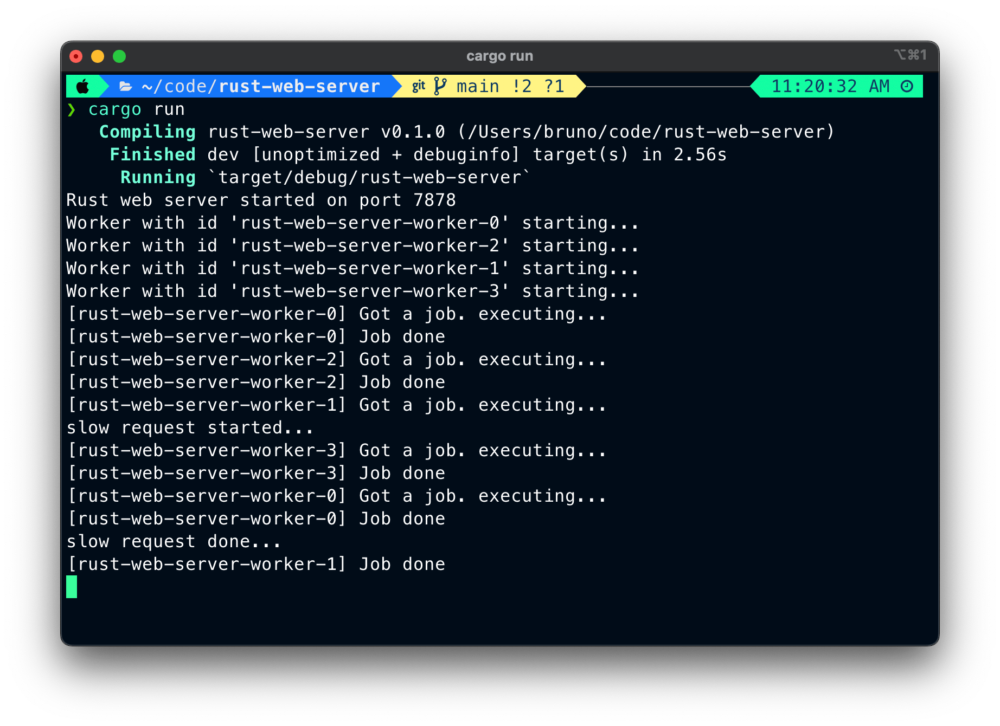

# Rust Web Server

A "poor man's" Rust web server to practice while reading the Rust Book.

This server can:

- Open a TCP socket and listen to HTTP connections
- Handle concurrent requests through multi-threading
- renders two HTML pages

## How to run it

Make sure that Rust is installed and run:

```shell
cargo run
```

Once the server starts, you should see a similar output like below:



### Available paths

To simulate load, we handle 3 paths:

- `/`: The index path
- `/sleep`: Simulate a long-running request that takes 5 seconds to complete
- `/*`: Will render a 404 page
